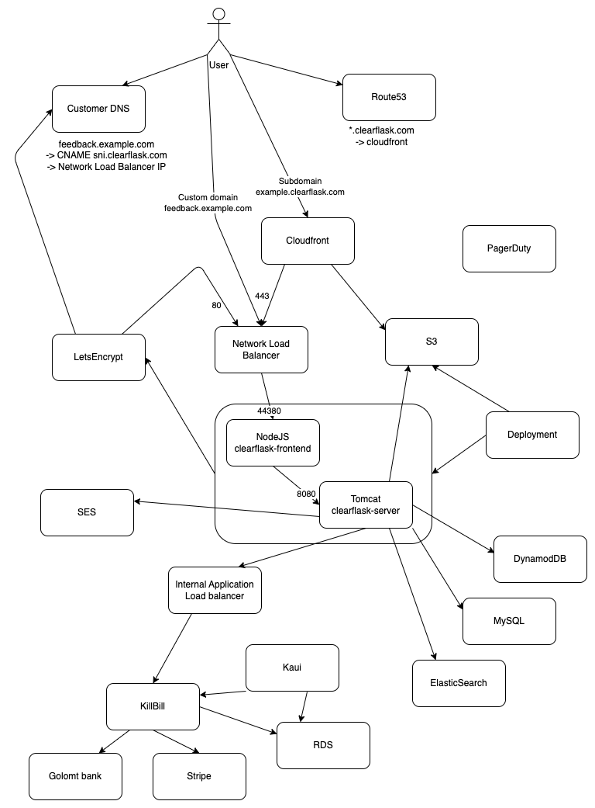

# Architecture

## Overall view

The following is a production deployment of ClearFlask. It was once scribbled down during a conversation and now it's an
official architecture diagram until we have a better replacement.

***TODO** Show clearflask-connect architecture*
***TODO** Show clearflask-server architecture*

## Project Structure

#### clearflask-api

Contains OpenAPI definition for communication between frontend and backend. Also includes definition of project
settings.

#### clearflask-frontend

Client side React application containing the Landing page, customer dashboard and portal. Entry point is `index.ts`.

Also contains a NodeJS server nicknamed `Connect` that serves static files, Server-Side Rendered page as well as
handling dynamic TLS certificate issuing for customers. Entry point is `connect.ts`.

#### clearflask-legal

Resource module containing Privacy Policy and Terms of Service documents.

#### clearflask-logging

Server logging module used for formattinbg logs as well as sending criticial emails to SRE of any warnings or errors. It
is a separate package since it's used by both `clearflask-server` as well as KillBill servers.

#### clearflask-resources

ClearFlask official vector logo and resources.

#### clearflask-server

Server implementation of the OpenAPI definition to serve requests from clients. Uses several dependencies:

- DynamoDB: Most data is stored in this NoSQL database for fast access and scalability
- ElasticSearch: For relevant results and searching, data is replicated to ES for fast searching.
- S3: User uploaded images are served directly from S3.
- KillBill: For payment processing and billing management, KillBill is used.
