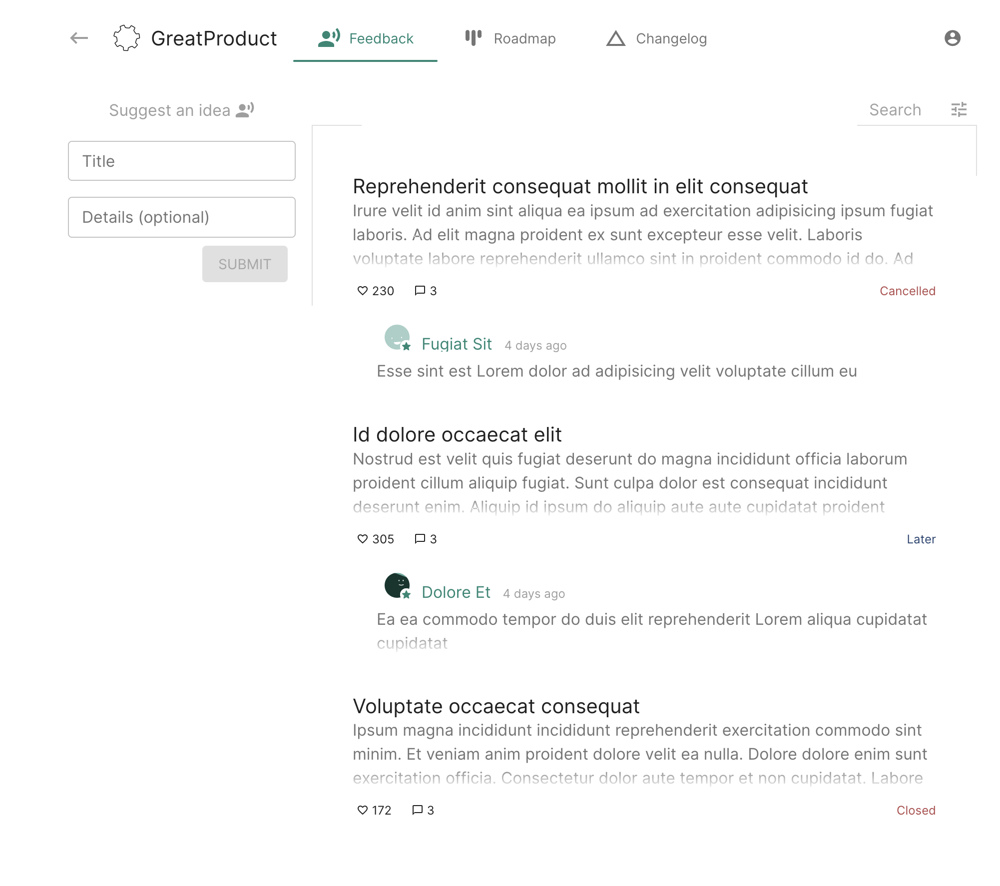
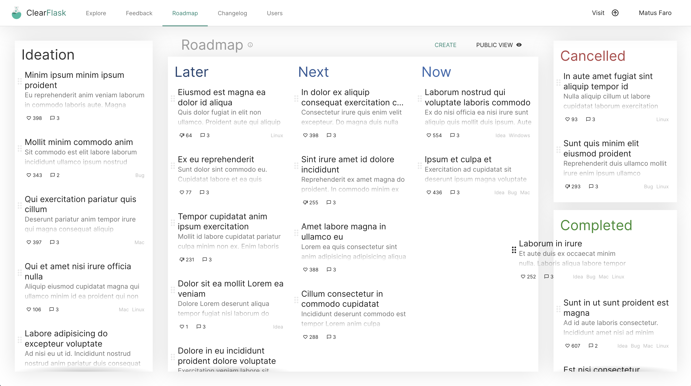
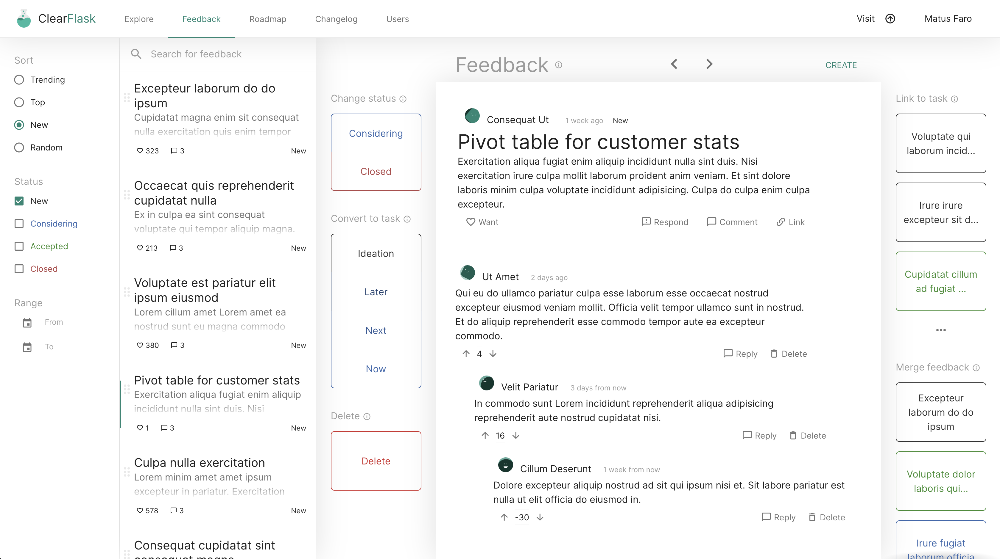
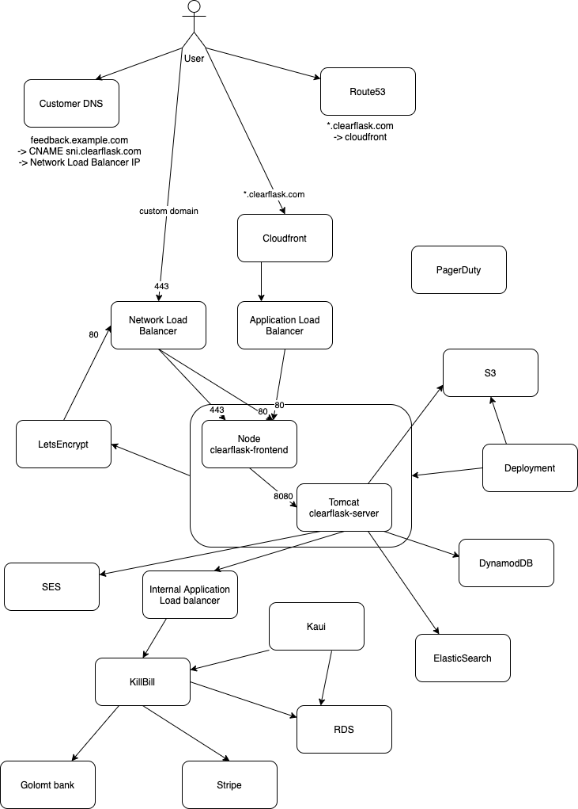

<p align="center">
  <a href="https://clearflask.com/" rel="noopener" target="_blank">
    
    <br />
    
  </a>
</p>

<div align="center">
  <a href="https://github.com/clearflask/clearflask/actions?query=workflow%3A%22CI%22">
    
  </a>
  <a href="https://github.com/clearflask/clearflask/releases">
    
  </a>
  <a href="https://github.com/clearflask/clearflask/blob/master/COPYING">
    
  </a>
</div>

<div align="center">

Listen to your users during product development with [ClearFlask](https://clearflask.com/)
<br />Open-source Feedback Management Tool.
  
<br />


  
<br />





</div>


### Contents
- [Managed hosting](#managed-hosting)
- [Self hosting](#self-hosting)
  - [Quick start](#quick-start)
  - [Deploy dependencies](#deploy-dependencies)
      - [Via Docker](#via-docker)
      - [Via AWS](#via-aws)
  - [Deploy ClearFlask](#deploy-clearflask)
      - [Setup](#setup)
      - [Run](#run)
- [Contributing](#contributing)
  - [Code quality](#code-quality)
  - [Building](#building)
  - [Architecture](#architecture)
  - [Release](#release)
- [Security Policy](#security-policy)


# Managed Hosting

Support our open-source development by choosing cloud hosting with [scalable pricing](https://clearflask.com/pricing), check us out on [our website](https://clearflask.com).


# Self Hosting

## Quick start

For a quick start using [Docker](https://www.docker.com/products/docker-desktop), download
the [Docker Compose service file](clearflask-release/src/main/docker/compose/docker-compose.self-host.yml)
as `docker-compose.yml`, and run the following:

```shell
docker-compose --profile with-deps up
```

Point your browser at [http://localhost](http://localhost) and create an account using email `admin@localhost`.

If you wish to host it remotely other than `localhost`, read the [DNS section](#dns).

Otherwise read on to deploy a long-term installation.

## Deploy dependencies

There are several dependencies you need for running ClearFlask:

- **ScyllaDB** or **AWS DynamoDB** or API-compatible alternative
- **MinIO** or **AWS S3** or API-compatible alternative
- **ElasticSearch** or **OpenSearch**
- **Email service via SMTP** or **AWS SES**

And a few optional:

- **Google ReCaptcha**
- **Let's Encrypt** automagic certificate management
- **CloudFront** as a CDN (Use in front of `clearflask-connect`)

### Via Docker

Although not intended for production, you can spin up all dependencies via Docker.

Simply add the `--profile with-deps` to your `docker-compose` command when starting ClearFlask.

All database content will be persisted to local filesystem under `data` folder.

### Via AWS

For production workload, you will want to spin up these dependencies yourself and point ClearFlask to their endpoints.

##### IAM access

For AWS services, `clearflask-server` auto-detects Access Keys using either a configuration property or the default
locations. If you are running in EC2 or ECS, keys detection is automated, you just need to create the appropriate IAM
role.

##### AWS DynamoDB

Provide IAM access including create table permission as table is created automatically by ClearFlask on startup.

IAM actions:

- CreateTable
- BatchGetItem
- GetItem
- Query
- BatchWriteItem
- DeleteItem
- PutItem
- UpdateItem

##### AWS S3

Create a private bucket with IAM access to ClearFlask.

IAM actions:

- ListBucket
- GetObject
- DeleteObject
- PutObject

You can also use an API-compatible alternative service such as Wasabi, MinIO...

##### ElasticSearch

Recommended is AWS ES, give the proper IAM access

IAM actions, all in these categories:

- List
- Read
- Write
- Tagging

Alternatively you can deploy it yourself (cheaper) or host it on Elastic

##### AWS SES

In order to setup SES, you need to seek limit increase via AWS support.

Change the config property `...EmailServiceImpl$Config.useService` to `ses` and give the proper IAM access.

IAM actions:

- SendEmail
- SendRawEmail

Alternatively use any other email provider and fill out the SMTP settings

## Deploy ClearFlask

ClearFlask consists of two components:

- Tomcat application for serving API requests
- NodeJS for SSR, dynamic cert management and serving static files

### Setup

1. Download the [Docker Compose service file](clearflask-release/src/main/docker/compose/docker-compose.self-host.yml)
2. Run it with `docker-compose --profile with-deps up` which creates few configuration files in your local directory
3. Carefully read and modify `server/config-selfhost.cfg`.
4. Carefully read and modify `connect/connect.config.json`.
5. Adjust the Docker Compose service file to add/remove dependencies if you are hosting them outside of Docker

#### DNS

By default, everything is assumed to be on `localhost`. If you wish to host your portal on `yoursite.com`
or `192.168.1.123`, set the following properties:

- `connect.config.json:parentDomain`: `yoursite.com`
- `config-selfhost.cfg:com.smotana.clearflask.web.Application$Config.domain`: `yoursite.com`

#### Certificate management

##### Automagic using Let's Encrypt

If you wish to have certificates fetched and renewed for you automagically using Let's Encrypt, ensure your DNS is
correctly pointing to your server, it is publicly accessible, and set the following config parameters:

- `connect.config.json:disableAutoFetchCertificate`: `false`
- `connect.config.json:forceRedirectHttpToHttps`: `true`
- `config-selfhost.cfg:com.smotana.clearflask.web.resource.ConnectResource$Config.domainWhitelist`: `^yoursite.com$`
- `config-selfhost.cfg:com.smotana.clearflask.web.security.AuthCookieImpl$Config.authCookieSecure`: `true`

Once you load your site for the first time, a Certificate is auto-magically fetched for you.

##### Self-managed behind reverse proxy

If you are managing TLS certificates behind a reverse proxy, redirect all `http` requests to `https`, set the following
config:

- `connect.config.json:disableAutoFetchCertificate`: `true`
- `connect.config.json:forceRedirectHttpToHttps`: `true`
- `config-selfhost.cfg:com.smotana.clearflask.web.security.AuthCookieImpl$Config.authCookieSecure`: `true`

##### No certificates

Although discouraged, you can run ClearFlask over HTTP only. Ensure these settings are set:

- `connect.config.json:disableAutoFetchCertificate`: `true`
- `connect.config.json:forceRedirectHttpToHttps`: `false`
- `config-selfhost.cfg:com.smotana.clearflask.web.security.AuthCookieImpl$Config.authCookieSecure`: `false`

#### Dashboard account

For you to manage the dashboard, you need to whitelist an email to be able to create a super-admin account:

`config-selfhost.cfg:com.smotana.clearflask.web.security.SuperAdminPredicate$Config.superAdminEmailRegex`: `^admin@yoursite.com$`

After you sign-up, disable further signups using:

`config-selfhost.cfg:com.smotana.clearflask.web.resource.AccountResource$Config.signupEnabled`: `false`

### Run

1. Run `docker-compose up` or `docker-compose --profile with-deps up` to also start dependencies.
2. Point your browser at `http://localhost` or if you configured your DNS `https://yoursite.com`.
3. Create an account using `admin@localhost` email or based on your configuration of `superAdminEmailRegex`.


# Contributing

Your contributions are very much appreciated. Please see here on how to contribute to our codebase.

## Code quality

### Java

- Generally following the [Google Java Style Guide](https://google.github.io/styleguide/javaguide.html)
- **IntelliJ** Recommended: Code style formatting is in `.idea` folder
- It is expected to write a test for each functionality.

### JS/TS

- **VisualCode** recommended: code formatting and properties are defined in `.vscode` folder
- We are yet to establish a proper test framework. A proposal would be welcome.

## Building

### Environment setup

Development has been done under Mac, Linux, and Windows (with WSL)

The following requirements are a minimum:

- Java 11
- Maven
- Makefile (for local and production deployment)
- Docker
- FFmpeg and ffprobe (For `babel-plugin-transform-media-imports`)
- OpenSSL (For local deployment's self-signed certs)

```shell
brew install maven ffmpeg make openssl
```

Please let us know if we missed anything.

### Compile and build

Building is straightforward and can be done by running:

```shell
mvn clean install
```

Add `-DskipTests` or `-DskipITs` to skip all tests or just Integration tests respectively.

For developing integration tests, you may want to start a local instance of ClearFlask and run integrations directly
from your IDE. Otherwise you will have to alwasy spin up all dependencies.

### Run locally

There are several ways to run locally depending on what you want to test.

#### Frontend + Mock backend

Ideal for fast-iteration on frontend changes. Changes to code take effect immediately.

```shell
make frontend-start
```

Open browser at [http://localhost:3000](http://localhost:3000).

#### Connect + Frontend + Mock backend

Intended for testing Connect and SSR. For code changes to take effect, you must rebuild clearflask-frontend.

```shell
make connect-start
```

Open browser at [http://localhost:9080](http://localhost:9080).

#### HTTPS + Connect + Frontend + Backend

Intended for testing the whole deal before deployment. For code changes to take effect, you must completely rebuild
clearflask.

```shell
make local-up
make local-down
```

Open browser at [https://localhost](https://localhost).

#### Connect + Frontend + Backend (Self-host)

Intended for testing self-host deployment, uses locally built Docker images rather than officially released images. For
code changes to take effect, you must completely rebuild clearflask.

```shell
make selfhost-up
make selfhost-down
```

Open browser at [https://localhost](https://localhost).

### Debugging

When running a local deploy, you can debug various components:

#### Attach debugger

For debugging `clearflask-server` running on Tomcat, point IntelliJ IDEA or your favourite IDE to remote JVM debug
on `localhost:9999`.

#### JMX

For changing configuration parameters or running exposed operations, connect via JMX using your favourite tool (
JVisualVM, JConsole, ...) on `localhost:9950` without credentials and without SSL.

#### ElasticSearch Kibana

To look at the ES cluster and run commands, point your browser at `http://localhost:5601`.

#### KillBill Kaui

To look at the billing sysstem, point your browser at `http://localhost:8081`.

Credentials are `admin/password` and API key and secret is `bob/lazar`.

If you are debugging an Integration Test, a log line will reveal the API key and
secret: `KillBill test randomized apiKey {} secretKey {}`.

#### AWS services (DynamoDB, Route53, SES, S3)

You can use regular AWS command line tool and point it to our mocked up LocalStack services:

```shell
aws --endpoint-url=http://localhost:4566 ...
```

## Architecture

### Overall view

The following is a production deployment of ClearFlask. It was once scribbled down during a conversation and now it's an
official architecture diagram until we have a better replacement.



### Project Structure

##### clearflask-api

Contains OpenAPI definition for communication between frontend and backend. Also includes definition of project
settings.

##### clearflask-frontend

Client side React application containing the Landing page, customer dashboard and portal. Entry point is `index.ts`.

Also contains a NodeJS server nicknamed `Connect` that serves static files, Server-Side Rendered page as well as
handling dynamic TLS certificate issuing for customers. Entry point is `connect.ts`.

##### clearflask-legal

Resource module containing Privacy Policy and Terms of Service documents.

##### clearflask-logging

Server logging module used for formattinbg logs as well as sending criticial emails to SRE of any warnings or errors. It
is a separate package since it's used by both `clearflask-server` as well as KillBill servers.

##### clearflask-resources

ClearFlask official vector logo and resources.

##### clearflask-server

Server implementation of the OpenAPI definition to serve requests from clients. Uses several dependencies:

- DynamoDB: Most data is stored in this NoSQL database for fast access and scalability
- ElasticSearch: For relevant results and searching, data is replicated to ES for fast searching.
- S3: User uploaded images are served directly from S3.
- KillBill: For payment processing and billing management, KillBill is used.

## Release

Intended for ClearFlask developers, this guide is for making a release of ClearFlask to create Docker images and Maven artifacts.

### Prerequisites

You need credentials for uploading to GitHub Packages repository for both Docker and Maven.

In GitHub personal settings create a PAT with `read:packages`, `write:packages`, and `delete:packages` scopes.

For Docker registry, run this command and input your PAT as password:

```shell
docker login ghcr.io -u USERNAME
```

Then fill out the following with your PAT and put it under `~/.m2/settings.xml`:

```xml

<settings xmlns="http://maven.apache.org/SETTINGS/1.0.0"
          xmlns:xsi="http://www.w3.org/2001/XMLSchema-instance"
          xsi:schemaLocation="http://maven.apache.org/SETTINGS/1.0.0
                          https://maven.apache.org/xsd/settings-1.0.0.xsd">

    <servers>
        <server>
            <id>github</id>
            <username>matusfaro</username>
            <password>~~INSERT PAT TOKEN~~</password>
        </server>
    </servers>

    <profiles>
        <profile>
            <id>github</id>
            <repositories>
                <repository>
                    <id>central</id>
                    <url>https://repo1.maven.org/maven2</url>
                </repository>
                <repository>
                    <id>github</id>
                    <url>https://maven.pkg.github.com/OWNER/*</url>
                    <snapshots>
                        <enabled>true</enabled>
                    </snapshots>
                </repository>
            </repositories>
        </profile>
    </profiles>

    <activeProfiles>
        <activeProfile>github</activeProfile>
    </activeProfiles>

</settings>
```

### Perform release

To perform a release, decide which version to increment and run the following Makefile target:

```shell
make release-<patch|minor|major>
```

#### Continuing a failed release

If the `perform:prepare` Maven target failed, you can re-run the whole release again from beginning.

If the `perform:release` Maven target failed, you can resume it by:

```shell
cd target/checkout
mvn deploy -P docker-images-push -rf clearflask-<module-to-resume>
```


# Security Policy

## Reporting a Vulnerability

Please report to security@clearflask.com for all vulnerabilities or questions regarding security. We will issue a bounty for useful vulnerabilities to pay for your contribution, however we do not have a set standard on the amount and type of vulnerabilities at this time.
